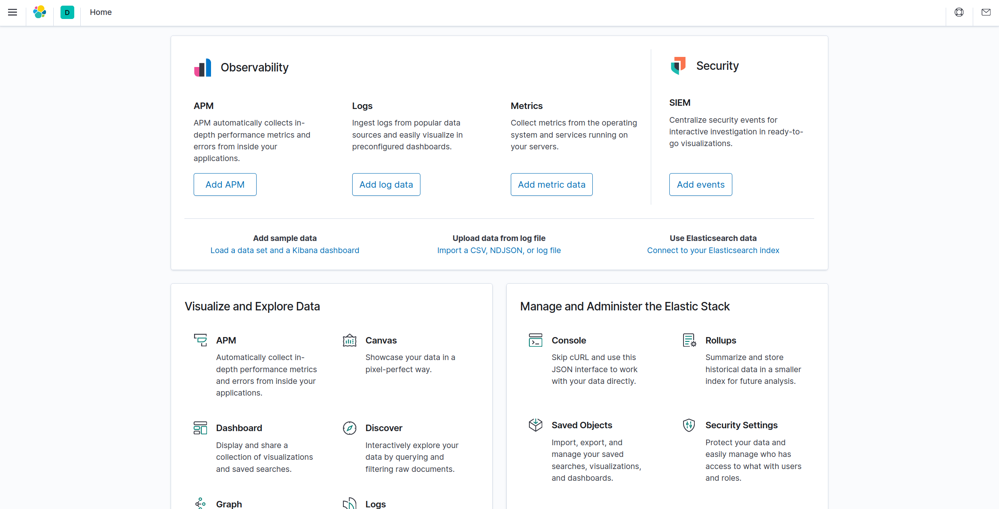

# elk-stack-k8s-simple

单机测试，elastic-stack部署，学习用,需要k8s环境<br>
简单方式部署，增加ik分词器插件

> filbeat(in nginx pod) --> elasticsearch --> kibana(ui)

---

## 部署elasticsearch、kinaba

执行脚本
> $ ./run-elk.sh

- 1.在当前目录下创建data目录，elasticsearch:data、plugins目录
- 2.替换k8s-yaml/elasticsearch-statefulSet.yaml中hostpath的${DATA_DIR}为当前目录data/elasticsearch
- 3.下载ik分词器插件
- 4.部署(`todo:filebeat`)

## 删除测试组件（会删除namespace:elk）

执行脚本

>$ ./delete-elk.sh

---

## 使用

- 查看cluster ip:
    ```
    $ kubectl get svc -n elk
    NAME            TYPE        CLUSTER-IP       EXTERNAL-IP   PORT(S)    AGE
    elasticsearch   ClusterIP   10.152.183.114   <none>        9200/TCP   6s
    kibana          ClusterIP   10.152.183.170   <none>        5601/TCP   5s
    ```

- 或者pod ip
    ```
    $ kubectl get pods -n elk
    NAME                      READY   STATUS    RESTARTS   AGE
    elasticsearch-0           1/1     Running   0          24m
    kibana-5777597974-shwlf   1/1     Running   0          24m
    ```

- 验证es
    ```
    $ curl 10.152.183.114:9200
    {
        "name" : "elasticsearch-0",
        "cluster_name" : "docker-cluster",
        "cluster_uuid" : "dNSyom5STB6Kkyx6GpmTbQ",
        "version" : {
            "number" : "7.8.1",
            "build_flavor" : "default",
            "build_type" : "docker",
            "build_hash" : "b5ca9c58fb664ca8bf9e4057fc229b3396bf3a89",
            "build_date" : "2020-07-21T16:40:44.668009Z",
            "build_snapshot" : false,
            "lucene_version" : "8.5.1",
            "minimum_wire_compatibility_version" : "6.8.0",
            "minimum_index_compatibility_version" : "6.0.0-beta1"
        },
        "tagline" : "You Know, for Search"
    }
    ```

- 访问kibana， url：10.152.183.170:5601
    
