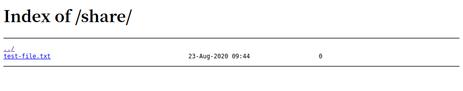
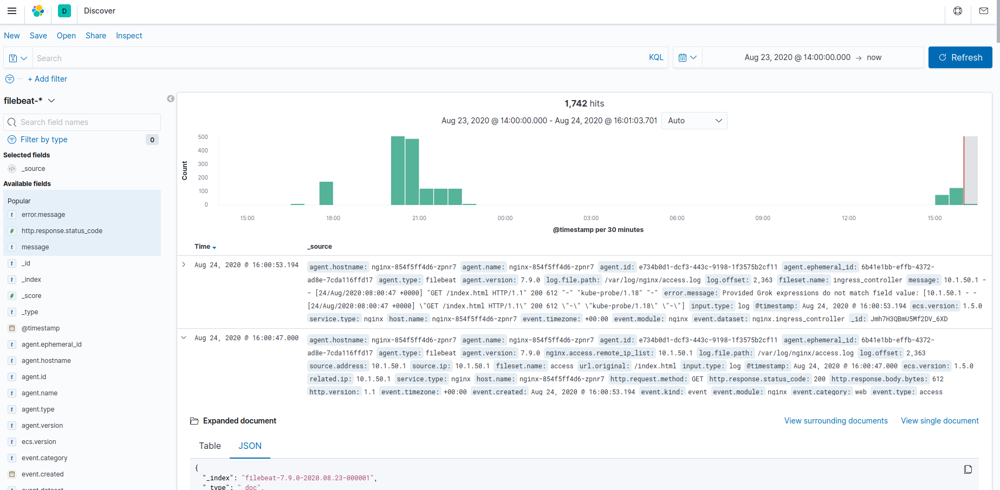
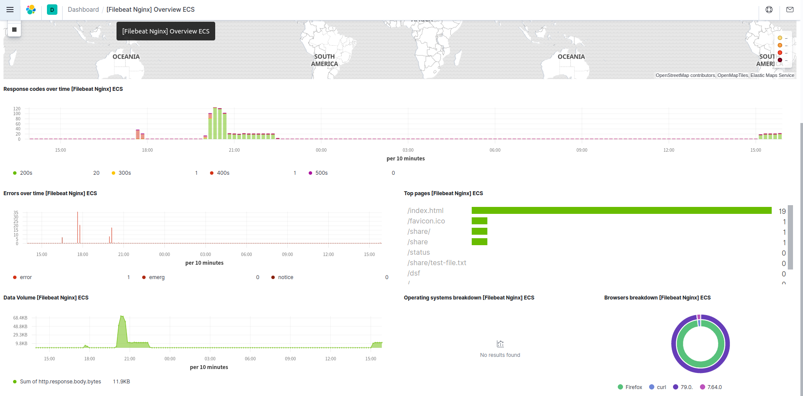

# elk-stack-k8s-simple

单机测试，elastic-stack部署，学习用,需要k8s环境<br>
简单方式部署，增加ik分词器插件

> filbeat(in nginx pod) --> elasticsearch --> kibana(ui)

---

## 部署elasticsearch、kinaba

执行脚本
> $ ./run-elk.sh

1. 提前拉取需要的镜像
2. 替换k8s-yaml/elasticsearch-statefulSet.yaml、nginx-deployment.yaml中hostpath的${DATA_DIR}为当前目录data
3. 在当前目录下创建data目录，elasticsearch：data、plugins目录
4. 在当前目录下创建nginx目录：conf.d（挂载本地配置文件）、share目录（本地共享目录例子：访问/share，展示当前目录下data/nginx/share文件列表）
5. share-nginx.conf：${当前目录}/data/nginx/share挂载到nginx容器内“/var/share/nginx/share”目录，作为共享文件列表
6. 下载ik分词器插件
7. 部署es，kibana，nginx+filebeat

## 删除测试组件（会删除namespace:elk）

执行脚本

>$ ./delete-elk.sh

---

## 使用

- 查看cluster ip:
    ```
    $ kubectl get svc -A
    NAMESPACE     NAME            TYPE        CLUSTER-IP      EXTERNAL-IP   PORT(S)                  AGE
    app           nginx           ClusterIP   10.152.183.33   <none>        80/TCP                   11m
    default       kubernetes      ClusterIP   10.152.183.1    <none>        443/TCP                  52d
    elk           elasticsearch   ClusterIP   10.152.183.12   <none>        9200/TCP                 23h
    elk           kibana          ClusterIP   10.152.183.19   <none>        5601/TCP                 23h
    kube-system   kube-dns        ClusterIP   10.152.183.10   <none>        53/UDP,53/TCP,9153/TCP   24d
    ```

- 查看pod ip
    ```
    $ kubectl get pods -A
    NAMESPACE     NAME                       READY   STATUS    RESTARTS   AGE
    app           nginx-854f5ff4d6-zpnr7     2/2     Running   0          19m
    elk           elasticsearch-0            1/1     Running   3          23h
    elk           kibana-6f86bfb9fd-95t7t    1/1     Running   3          23h
    kube-system   coredns-588fd544bf-wqlnw   1/1     Running   56         24d
    ```

- 查看configmap
    ```
    kubectl get configmap -n app
    NAME                    DATA   AGE
    nginx-filebeat-config   1      25h
    ```

- 验证es
    ```
    $ curl 10.152.183.12:9200
    {
        "name" : "elasticsearch-0",
        "cluster_name" : "docker-cluster",
        "cluster_uuid" : "dNSyom5STB6Kkyx6GpmTbQ",
        "version" : {
            "number" : "7.9.0",
            "build_flavor" : "default",
            "build_type" : "docker",
            "build_hash" : "a479a2a7fce0389512d6a9361301708b92dff667",
            "build_date" : "2020-08-11T21:36:48.204330Z",
            "build_snapshot" : false,
            "lucene_version" : "8.6.0",
            "minimum_wire_compatibility_version" : "6.8.0",
            "minimum_index_compatibility_version" : "6.0.0-beta1"
        },
        "tagline" : "You Know, for Search"
    }
    ```

- 访问kibana， url：10.152.183.19:5601
    

- 访问nginx
    - url：10.152.183.33/index.html 
    - url：10.152.183.33/share
    

- filebeat发送的access.log、error.log数据
    

- filebeat创建的dashboard模板
    
